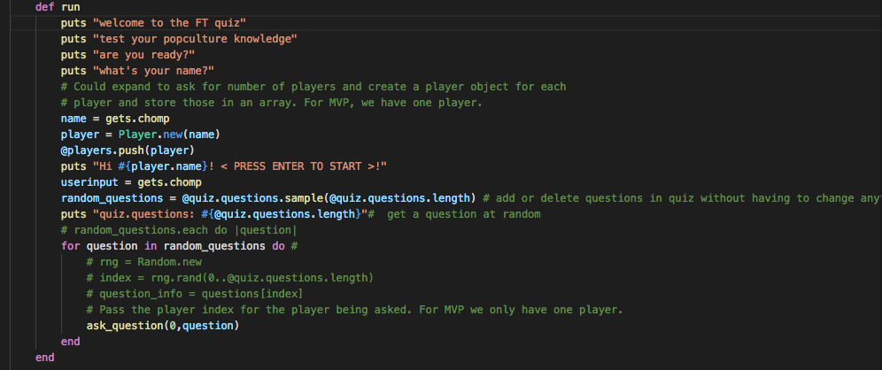
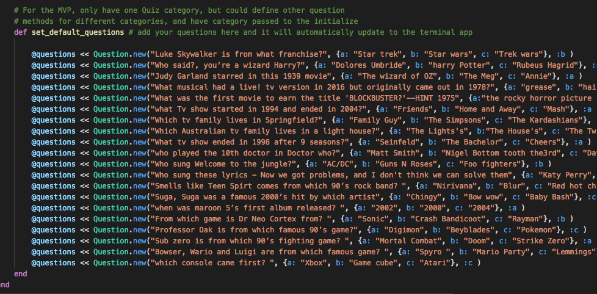
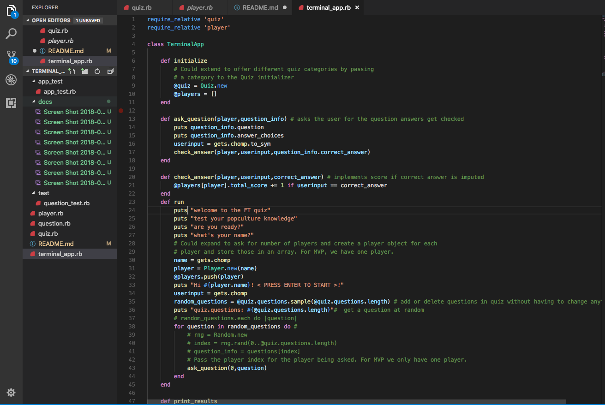
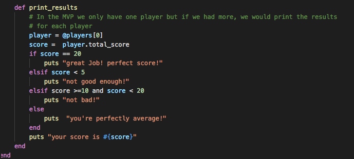
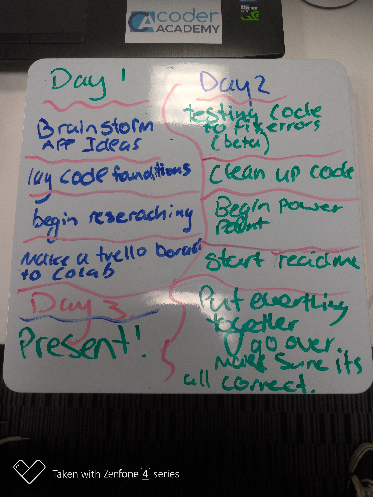
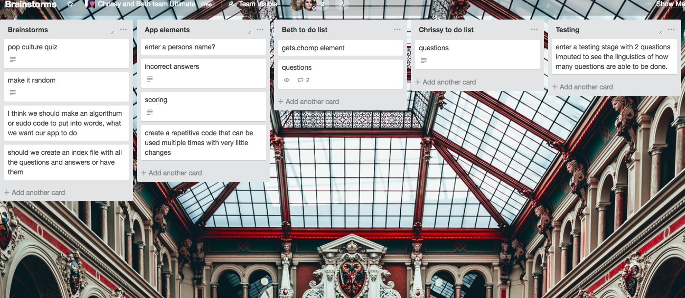
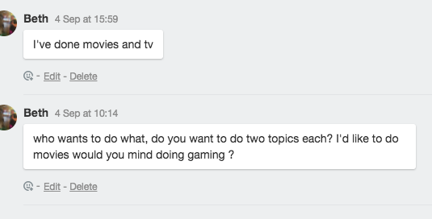

# TRIVIA APP

### A pop culture themed trivia quiz made up of 20 questions with 4 topics: gaming, movies, television and music. 5 questions each topic displayed in a random order with various degrees of difficulty.

## Authors 
#### •	Beth Callanan
#### •	Chrissy K

# Github

# Description
## Purpose 
The purpose of the app is to entertain the user and test their pop culture knoweldge. A pop culture themed trivia quiz made up of 20 questions with 4 topics: gaming, movies, television and music. 5 questions each topic displayed in a random order with various degrees of difficulty.
##Functionality

#Instructions for use:
1. User provides a name and presses enter to start.
2. players then gets asked 20 questions at random.
3. players options are a, b or c
4. players answers the question buy typing in a, b or c
5. then press enter to submit answer until all questions are answered.
6. the quiz is finished when all questions are answered
7. score is displayed then app is exited.

#Final app

#design details
# Brainstorming
## Game ideas: 
•	Hangman
•	Noughts and crosses
•	Trivia quiz (top choice)

Trivia Quiz
Things to consider
1.	What topic
2.	How to eliminate potential wrong answers due to wrong case or misspelt words. >> multiple choice
3.	How to store our questions and answers
4.	We need to randomise order of questions 
5.	How many questions
6.	Degree of difficulty

App details
20 questions
Theme: pop culture: 4 categories
1.	Music
2.	Film
3.	Tv
4.	Gaming
•	Name 
•	1980 – 2010?
Questions 
Music- 
•	a snippet of a lyric, whats the name of the song or artist 
•	at least one pop song 
•	guess the artist 
•	what year was this song released
film- 
•	what year did this film premier
•	who played this person in this
•	movie quotes who said?
Tv-
•	cartoon question
•	friends question 
•	a well known catchphrase from this show 
•	when did this show finish
Gaming-
•	what year did this console come out 
•	pokemon question
•	Mario or sonic question 
•	Pc gaming question 
Name ideas
The millennial quiz
Quiz that must not be named
How much time do you waste quiz
The TFMG quiz

A multiple choice quiz app that outputs 1 question with three possible answers A, B or C. 4 topics: film, Tv, gaming and music. To start, 3 questions (Testing: randomizing, scoring and output.) then add more questions 

•	Store all questions in a variable 
•	Set score as 0 then += 1 for a correct answer
•	Questions.length makes the total score 

Questions 

Movies-Beth
1.	Luke skywalker is from which franchise (starwars)
2.	Who said “you’re a Wizard Harry”? (Hagrid)
3.	Judy Garland starred as Dorothy Gale in which classic movie? (The wizard of oz)
4.	What musical had a live! Tv special but was originally released in 1978 (Grease) 
5.	The first movie given the title “blockbuster”(hint 1975) ( Jaws)

Tv- Beth
1.	What tv show started in 1994 and ended in 2004 (friends)
2.	Which tv family lives in Springfield (the Simpsons)
3.	Which Australian tv show family lives in a light house (the Twist’s)
4.	What tv show ended in 1998 after 9 seasons (Seinfeld)
5.	Who played the 10th doctor in Doctor Who (David Tenant)

Gaming-Chrissy
1. Who sung Welcome to the jungle?	(GUNS and ROSES)
2. Who sung these lyrics - Now we got problems, and I don't think we can solve them (Taylor Swift)
3. Smells like Teen Spirt comes from which 90’s rock band? (Nirivana)
4. Suga, Suga was a famous 2000’s hit by which artist? (Baby Bash)
5. when was maroon 5’s first album released? (2002)

Music-Chrissy
1.	From which game is Dr Neo Cortex from? (Crash Bandicoot)
2.	Professor Oak is from which famous 90’s game?" (Pokemon)
3.  Sub zero is from which 90’s fighting game? (Mortal Combat)	
4.	Bowser, Wario and Luigi are from which famous game? (Mario Party)
5.	which console came first? (Atari)

## Conclusion of brainstorming. 
We settled on a Game briefly considering a hangman app and noughts and crosses and a trivia app but came to the understanding that these three concepts could get very complicated very quickly so out of the three we chose a trivia app because we could break it down into a simple concept and the possibility that we could use one standard code that we can repeat until all questions are answered. 

#design details CONT
app user workflow 

project timeline 

# Trello 

